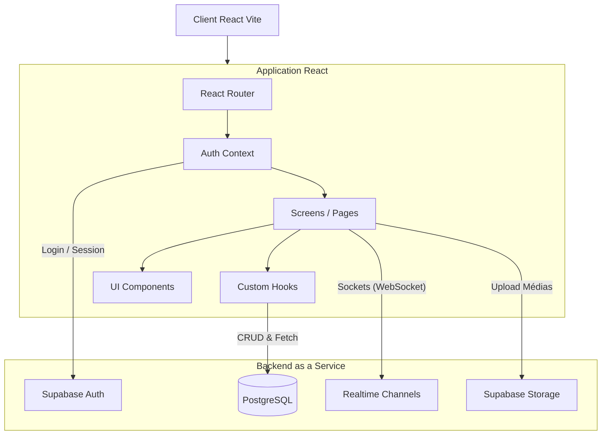

# Architecture de Safe Alert

Ce document décrit l'architecture technique globale de l'application Safe Alert, couvrant le Frontend, le Backend (Supabase) et les interactions système.

## 🏗️ Vue d'ensemble (Schéma)

## 💻 Frontend (React + Vite)

Le frontend est une application Single Page Application (SPA) bâtie avec React et Vite. Elle est conçue pour être "Mobile-First" pour la vue citoyenne, et "Desktop-First" pour le tableau de bord administrateur.

### Concepts clés :
1. **Routing Intelligent (`App.tsx`)** :
   Le router redirige dynamiquement l'utilisateur selon sa taille d'écran (Responsive) et son rôle (Admin vs Citoyen).
   - *Desktop + Admin* = Redirection vers `/admin` (Tableau de bord de crise).
   - *Mobile / Citoyen* = Redirection vers `/home` (Vue PWA mobile).

2. **State Management & Hooks** :
   L'état est principalement géré de manière locale et via des contextes (ex: `AuthContext`). La récupération de données asynchrones est encapsulée dans des custom hooks (ex: `useAlerts.ts` pour fetcher et poller la base de données).

3. **Cartographie (Leaflet)** :
   Utilisation de `react-leaflet` couplée avec OpenStreetMap et les tuiles ESRI pour offrir une expérience cartographique fluide et déconnectée de solutions payantes strictes comme Google Maps.

## ⚙️ Backend (Supabase)

L'application n'a pas de serveur backend Node.js classique (Express/Nest). Elle s'appuie entièrement sur **Supabase**, qui agit comme un BaaS (Backend as a Service).

### Composants Supabase utilisés :

1. **PostgreSQL** : Cœur du système. Base de données relationnelle robuste qui stocke utilisateurs, alertes, signalements et équipes.
2. **PostgREST** : Génère automatiquement l'API REST à partir du schéma PostgreSQL. Le client `@supabase/supabase-js` communique avec cette API.
3. **Row Level Security (RLS)** : La sécurité est déportée directement dans la base de données. Les requêtes venant du client React sont interceptées et filtrées selon les `Policies` (ex: seul un Admin peut insérer une alerte, un citoyen ne peut voir que ses propres messages s'il n'est pas admin).
4. **Supabase Realtime** : Exploitation des WebSockets PostgreSQL (via la fonction `postgres_changes`). Permet aux `AdminDashboardScreen` et aux `TeamsScreen` de se mettre à jour instantanément lorsqu'un nouveau signalement ou message est créé, sans rafraîchir la page. Également utilisé pour le suivi GPS en direct des équipes (`team_locations`).
5. **Supabase Storage** : Stockage d'objets (S3-compatible) pour les avatars, les photos des alertes, et les médias uploadés par les citoyens lors d'un signalement.

## 🗺️ Coordination d'équipes (Phase 2)
1. **Géolocalisation Continue** : L'application utilise l'API de géolocalisation pour envoyer la position GPS des membres des équipes (`useGpsReporter`).
2. **Zones de Recherche (Polygones)** : Les admins utilisent `Leaflet-Draw` pour définir et sauvegarder des zones de recherche dans `search_zones`.
3. **Mise à jour Realtime** : L'admin peut voir les déplacements des équipes en temps réel sur une carte interactive (`TeamMap.tsx`) branchée au flux Supabase Realtime de `team_locations`.

## 🔄 Flux de données typique : Signalement Citoyen

1. Le citoyen ouvre l'application, l'API de géolocalisation du navigateur récupère ses coordonnées.
2. Le composant `ReportScreen` gère un stepper (Étape 1: Quoi, Étape 2: Où, Étape 3: Média).
3. À la soumission, l'image est d'abord envoyée à **Supabase Storage** (bucket `reports_media`).
4. L'URL publique/signée de l'image est récupérée.
5. Un enregistrement est inséré dans la table `reports` via **PostgREST** contenant la description, les coordonnées GPS, et l'URL du média.
6. Le serveur Supabase détecte l'insertion (INSERT sur `reports`).
7. **Supabase Realtime** pousse l'événement via WebSocket.
8. Le tableau de bord Admin, écoutant ce channel, met à jour son interface (incrémentation des compteurs, apparition sur la carte) instantanément.
